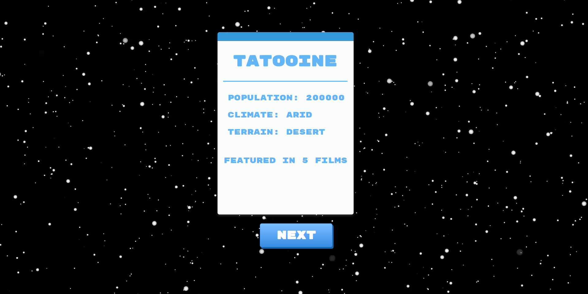
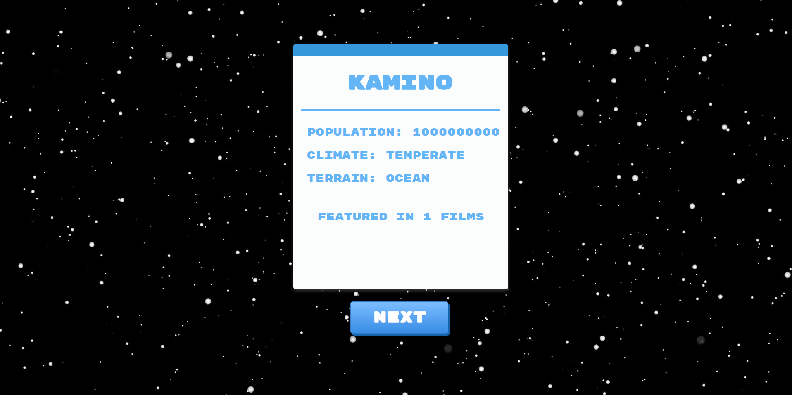

# Star Wars Planets 🌏

## Sobre o projeto: 📃
Projeto construído para o desafio técnico da B2W.

O objetivo era desenvolver uma aplicação front-end que pegue aleatoriamente um planeta da franquia Star Wars e exiba como seria o clima, o terreno e em quantos filmes da franquia ele apareceu.

## Requisitos do projeto: ✅
* Card
  
Um card contendo o título do planeta, o total da sua população, o clima o tipo de terreno e a quantidade de filmes que ele apareceu.

* Botão para o próximo planeta

Um botão que troque as informações do card para um novo planeta aleatório.

## Frameworks e Tecnologias Utilizadas: 🌌
### Front-End: 🎨

* <strong>CSS</strong> (Estilização)
* <strong>React Js</strong> (Criação da Interface)

### Backend: 💾

* <strong>SWAPI</strong> (API contendo diversas informações dos filmes da franquia Star Wars)

## Imagens: 📷

### <strong>Imagem 1:</strong>

### <strong>Imagem 2:</strong>

